# Artistic Multilingual Keyboards

A fully customizable Flutter package which allows you to add multi lingual keyboard in your apps. 
For now you can use English, Urdu and Sindhi, numeric and some special characters keyboards.
You can customize keyboards as you want them. 


## Features

### Example
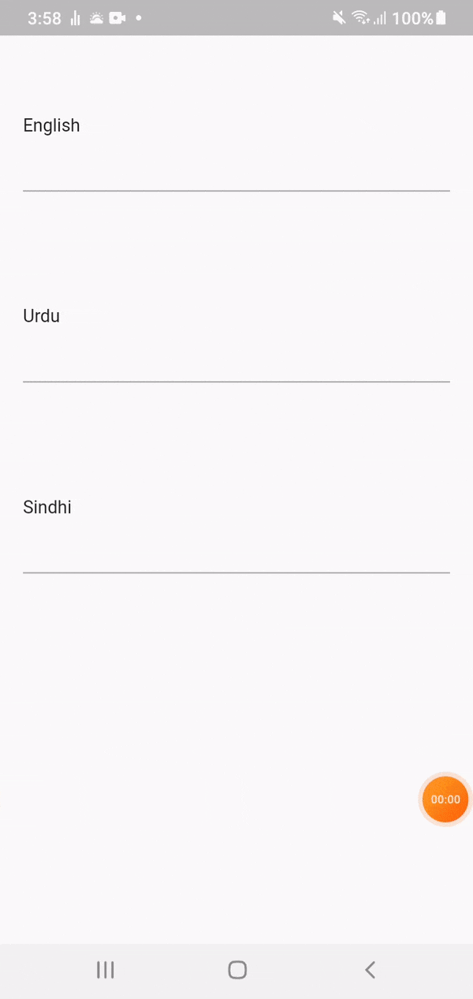

[comment]: <> (![Alt text]&#40;./screen_recording/screen_recording.gif =200x300&#41;)

### English Keyboards 

<span>
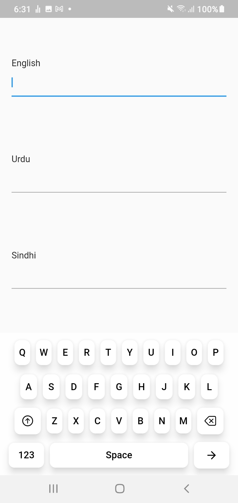 
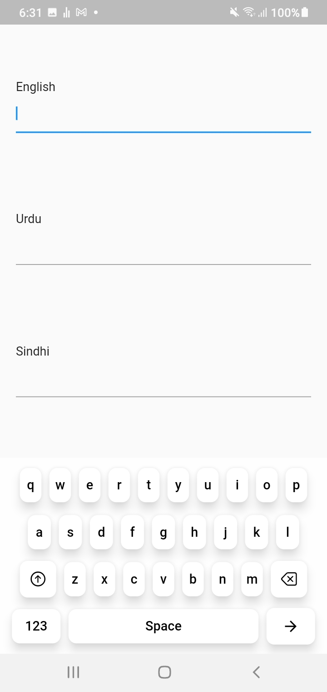
</span>


### Urdu Keyboards

<span>
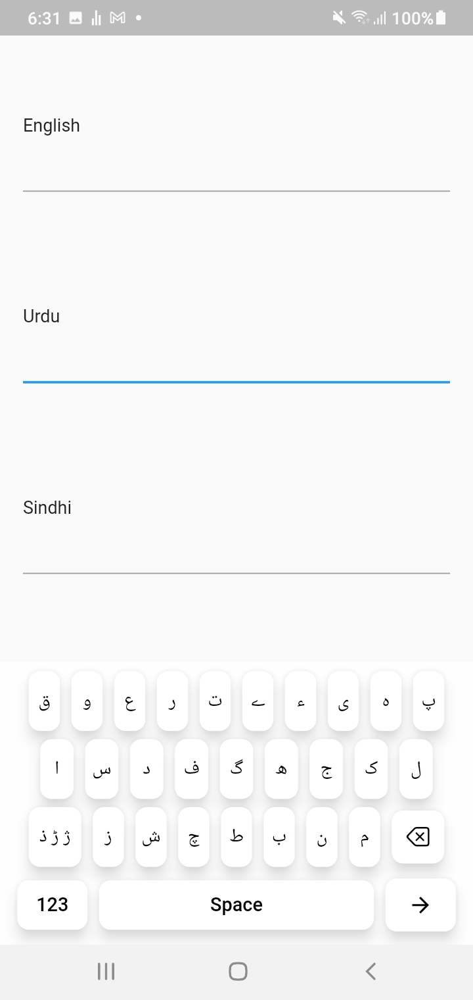 
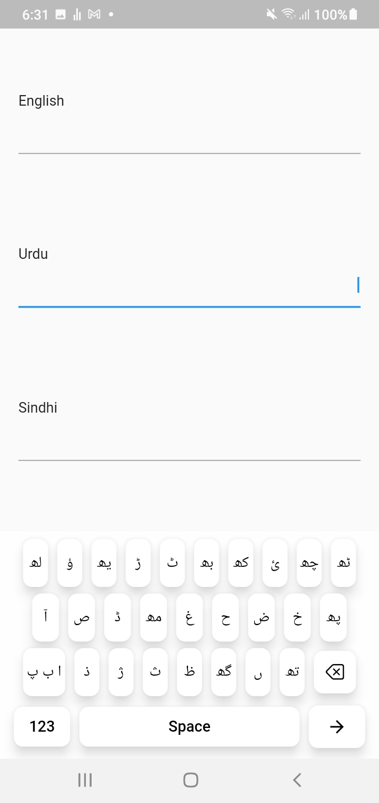</span>


### Sindhi Keyboards

<span>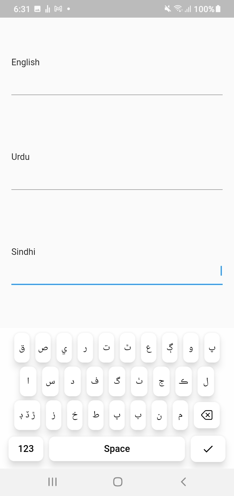
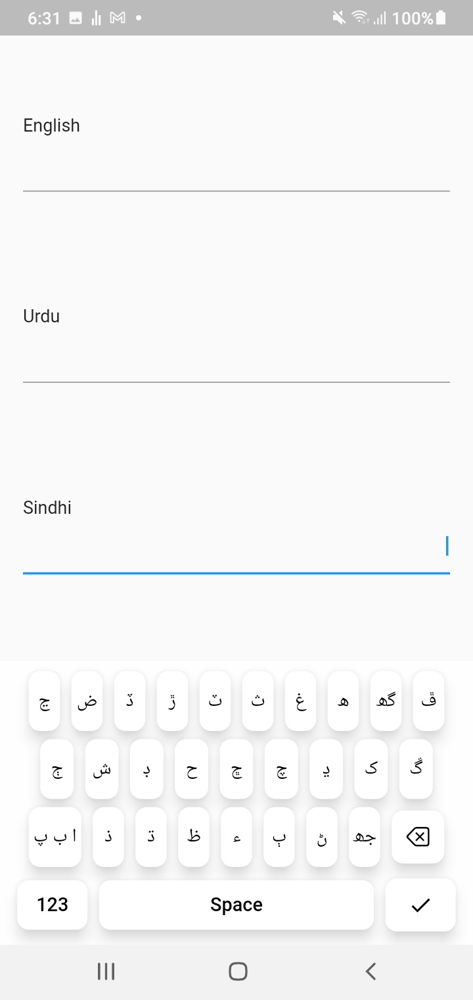</span>


### Numeric & Symbolic Keyboards

<span>
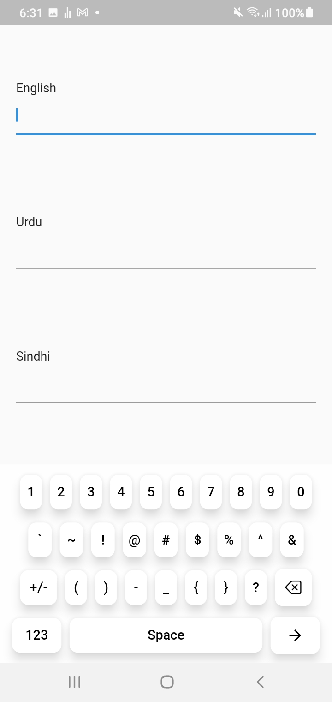 
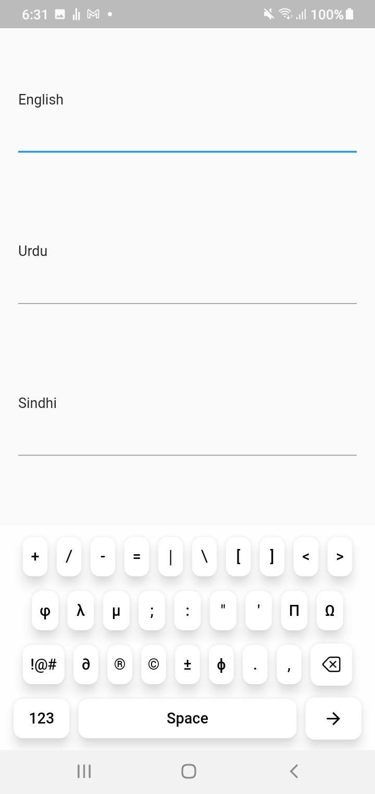</span>


### Keyboard Customized Designs

<span>
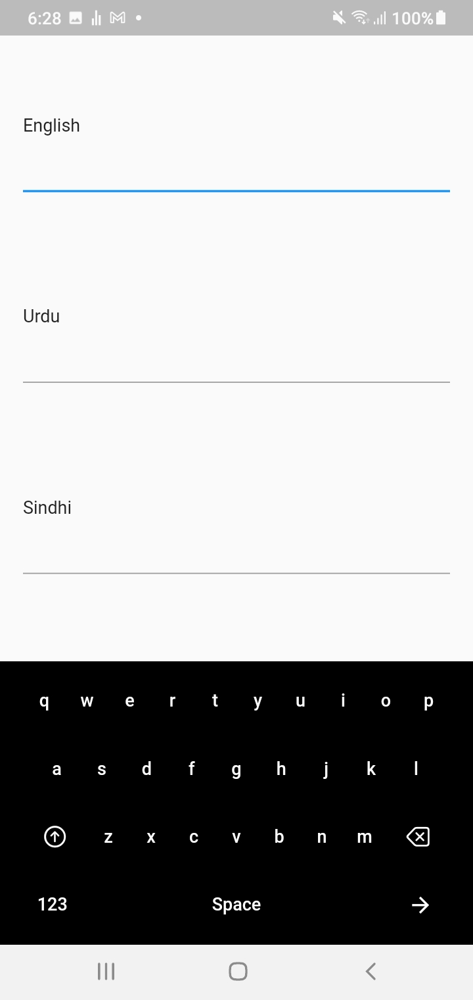 
 
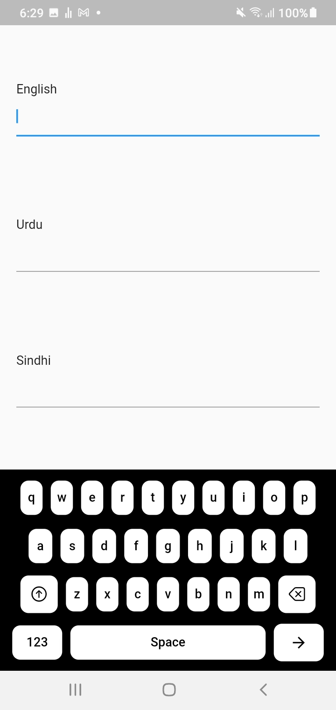 
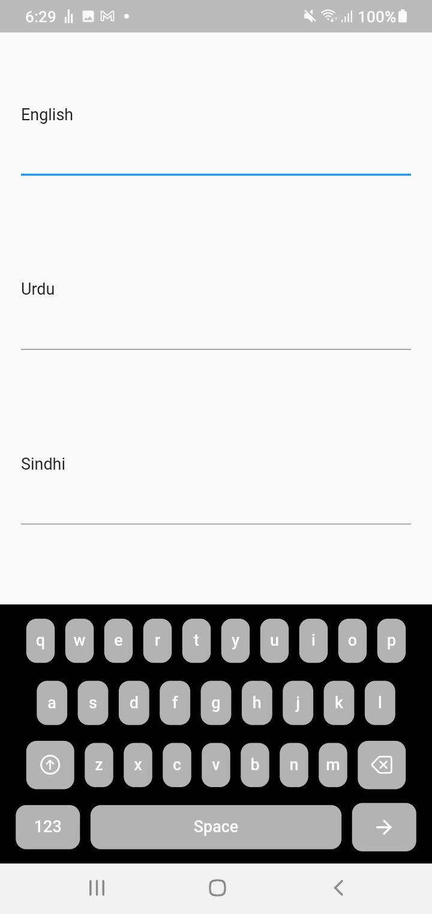 
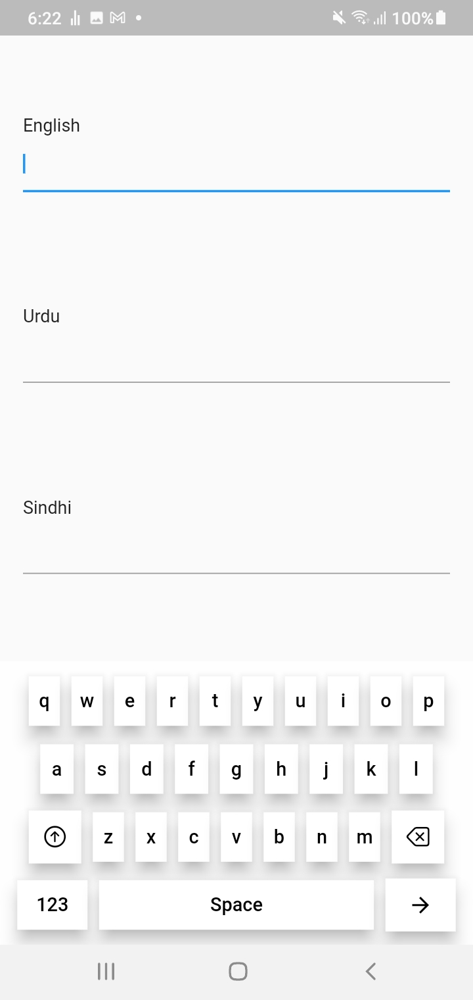 
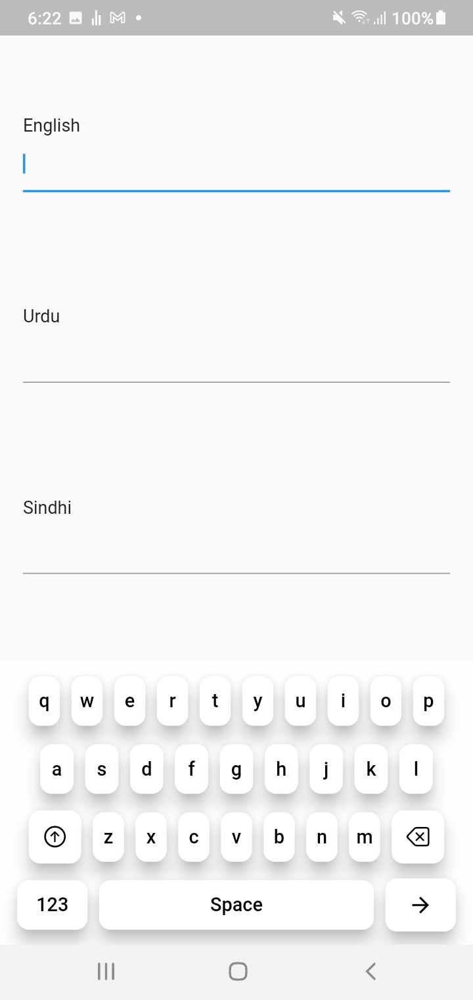 
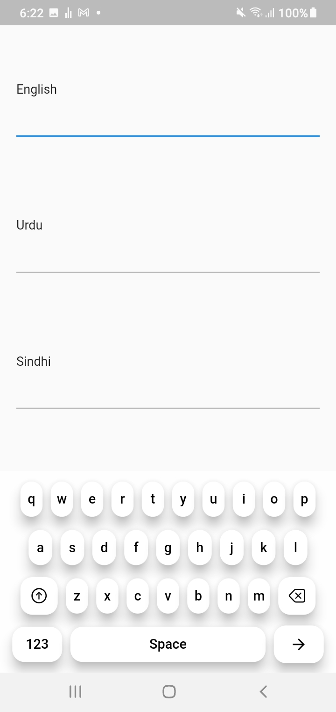</span> 


## Installation

### Dependency

Add the package as a dependency in your pubspec.yaml file.

```yaml
dependencies:
  artistic_multilingual_keyboards: "^1.0.0"
```

Or Run the following command.

```shell
$ flutter pub add artistic_multilingual_keyboards
```

### Import
Import following package in your code file.
```dart
import 'package:artistic_multilingual_keyboards/keyboards_layouts/keyboard_layouts.dart';
```

## Usage

Check complete example code from the "Example" Folder. 

```dart
  KeyboardLayouts(
    textEditingController: TextEditingController(),
    textEditingController: TextEditingController(),
    focusNode: FocusNode(),
    isKeyboardOpen: true,
    enableLanguageButton: false,
    keyElevation: 12,
    keyShadowColor: Colors.black,
    keyBorderRadius: BorderRadius.circular(10),
    keyboardAction: KeyboardAction.actionNext,
    currentKeyboardLanguage: KeyboardLanguages.english,  
  );
```


## Contribution

You can contribute by:
1. Use this package test and report any issues/bug found.
2. Contribute to package by adding more features.
3. Fill the form and give us your [suggestion or Feedback](https://docs.google.com/forms/d/e/1FAIpQLSdRY0yvBApd4QlUxTwEL4nycc8o-aNP70w9hPFrTgXzaeSH2w/viewform).


## Developer

[Kamran Khan](https://github.com/kamran8545)

